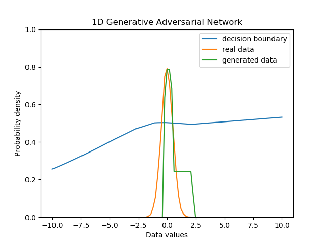

GAN Temporary document
======================

1d GAN
---------

# Result
## epoch timelapse

<table align='center'>
<tr align='center'>
 <td> Generate Distritubtion</td>
 <td> =Uniform(range = 8) </td>
 </tr>
<tr align='center'>
 <td> Data Distribution </td>
 <td> =N(-3,1) </td>
 </tr>
<tr>
 <td>
</tr>
</table>

## static result

| Generate Distritubtion   | Generate Distribution    | Generate Distribution      |
| =Uniform(range = 8)      | =Uniform(range = 8)      | =Uniform(range = 8)        |
|-------------------------|-------------------------|---------------------------|
| Data Distribution        | Data Distribution        | Date Distribution          |
| =N(0,1)                  | =N(0,2)                  | =N(0,0.5)                  |
|-------------------------|-------------------------|---------------------------|
|  | | |

### enviroment
1. epoch : 1000, batch size : 8, learning rate : 0.01
 

