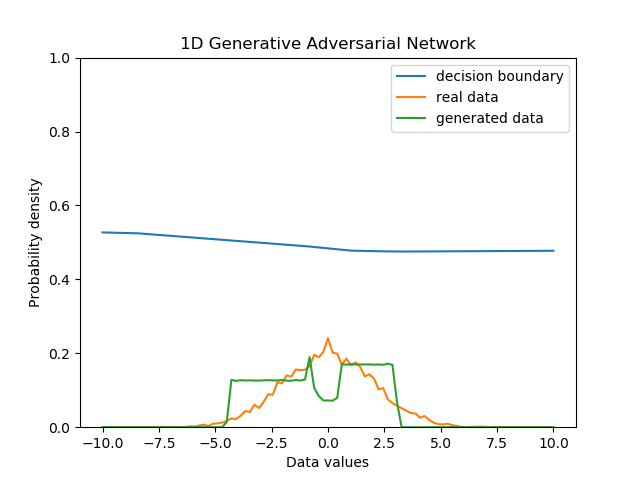

GAN Temporary document
======================

1d GAN
---------

# Result
## epoch timelapse

| Generate Distritubtion   | 
| =Uniform(range = 8)      |
|-------------------------|
| Data Distribution        |
| =N(-3,1)                 |
|-------------------------|
|  |

## static result

| Generate Distritubtion   | Generate Distribution    | Generate Distribution      |
| =Uniform(range = 8)      | =Uniform(range = 8)      | =Uniform(range = 8)        |
|-------------------------|-------------------------|---------------------------|
| Data Distribution        | Data Distribution        | Date Distribution          |
| =N(0,1)                  | =N(0,2)                  | =N(0,0.5)                  |
|-------------------------|-------------------------|---------------------------|
|  | | |

### enviroment
1. epoch : 1000, batch size : 8, learning rate : 0.01
 

